# taskmaster

## TaskMaster Application

**TaskMaster is an android application that will be the main focus of the second half of the 401 course: TaskMaster. While you’ll start small today, over time this will grow to be a fully-featured application.**

### List of Activities

- Main Activity
- Add Task Activitiy
- All Tasks Activitiy
- Task Detail Page Activity
- Settings Page Activity

### Lab 26

#### Main Activity

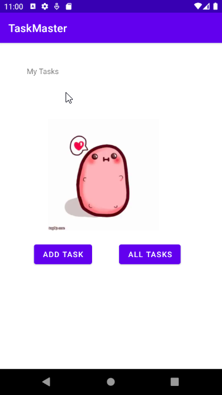

#### Add Task Activity

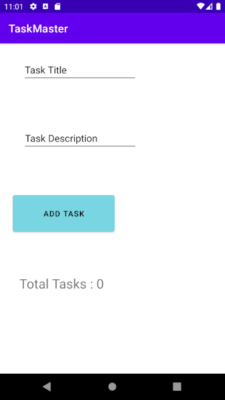

#### All Tasks Activity

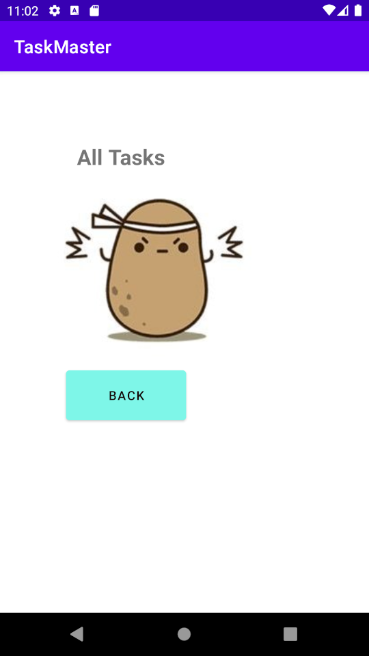

### Lab 27

#### Main Activity

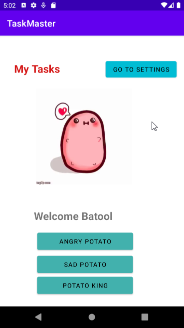

#### Task Detail Page Activity

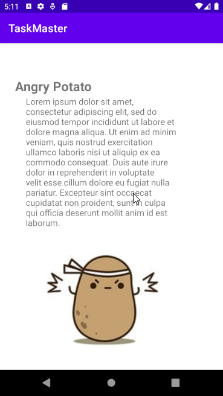
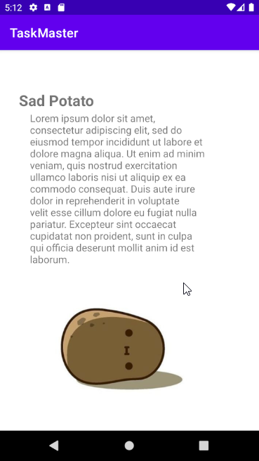
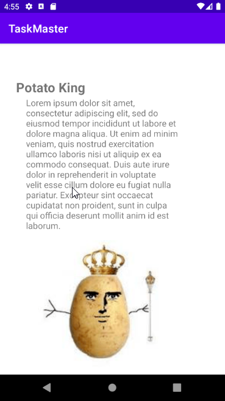

#### Settings Page Activity

### Lab 28

#### Main Activity + button click(goes to detail page)

#### Task1

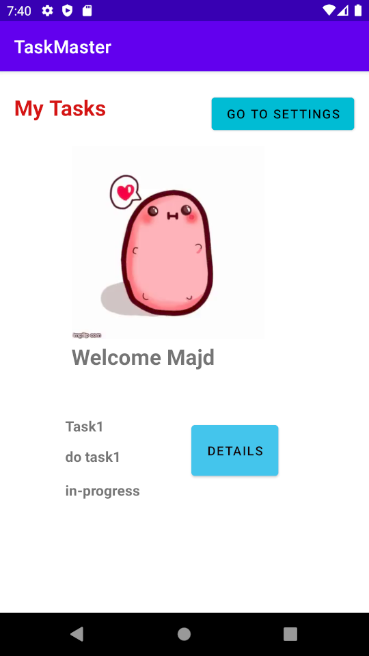
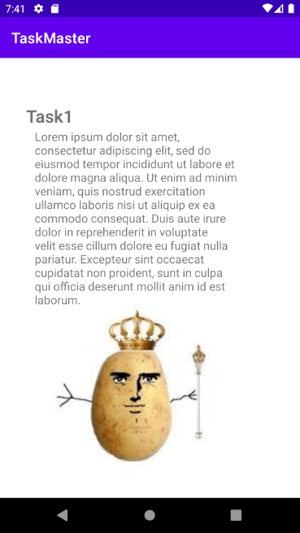

#### Main Activity + button click(goes to detail page)2

#### Task2

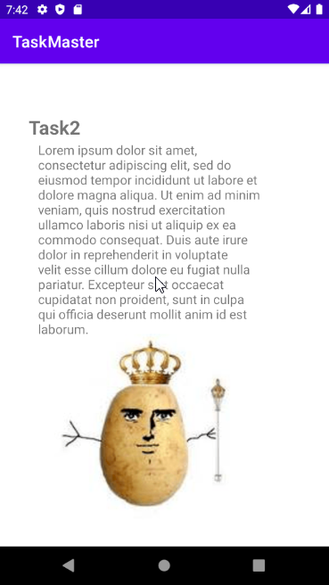

### Lab29

#### Main Activity

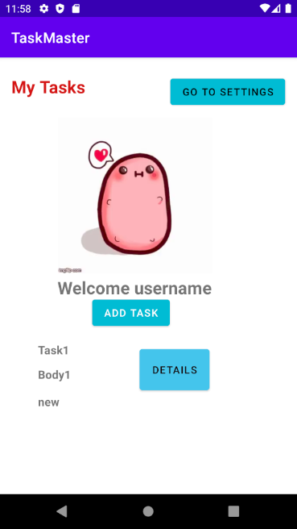

#### Detail Activity

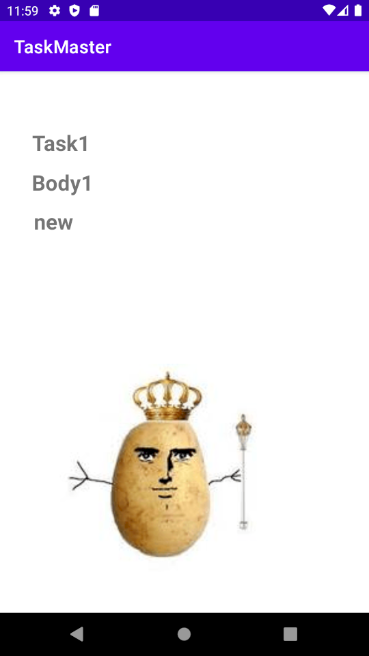